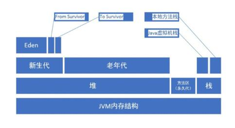

## Java内存区域

#### 运行时数据区域（Java SE 7版）
- 程序计数器
- 方法栈
	- 虚拟机栈
	- 本地方法栈
- 堆
- 方法区

#### 程序计数器
- 字节码解释器工作时就是通过改变这个计数器的值来选取下一条需要执行的字节码指令，分支、循环、跳转、异常处理、线程恢复等基础功能都依赖这个程序计数器来完成；
- 每个线程都有自己的独立程序计数器（线程私有内存）;
- 如果程序正在执行的是java方法，计数器的纪录就是正在执行的虚拟机字节码指令的地址；
- 如果正在执行的是Native方法，则这个计数器的纪录为空；
- 此区域没有规定任何`OutOfMemoryError`;

#### Java虚拟机栈
- Java虚拟机栈是线程私有的，生命周期与线程一致；
- 每个方法执行的同时都会创建一个栈帧用于存储：
	- 局部变量表
		- 局部变量表存放了编译期可知的各种基本数据类型和对象引用类型：
			- 基本类型
				1. boolean
            	2. byte
            	3. char
            	4. short
            	5. int
            	6. float
            	7. long（64位，占用两个局部变量空间）
            	8. double（64位，占用两个局部变量空间）
            - 对象引用类型
            	1. 可能是一个指向对象起始地址的指针
            	2. 也可能是指向一个代表对象的句柄
            	3. 或者其他和这个对象相关的地址
            - returnAddress类型
            	1. 指向一条字节码指令的地址
    	- 局部变量表所需要的内存空间在编译期就完成了分配，当进入一个方法时，这个方法需要在帧中分配多大的局部变量空间是完全可以确定的，方法运行期间无法改变局部变量表的大小;
	- 操作数栈
	- 动态链接
	- 方法出口等信息
- 方法的调用到执行完毕，就是栈帧在虚拟机栈中入栈到出栈的过程；
- 如果线程请求的栈深度大于虚拟机允许的深度，将抛出StackOverflowError;
- 如果虚拟机允许动态扩展，扩展时无法申请到足够的内存就会抛出OutOfMemoryError；

#### 本地方法栈
- 与Java虚拟机栈作用相似：
	- Java虚拟机栈为虚拟机执行Java方法（字节码）服务
	- 本地方法栈为Native方法服务
	- 不同的虚拟机对Java虚拟机栈与本地方法栈的实现不同
	- 本地方法栈也会抛出StackOverflowError和OutOfMemoryError

#### Java堆
- 所有线程共享这一区域
- 几乎所有对象实例都在这里分配内存，存放所有的对象实例
- 所有的对象实例和数组都在堆上分配
- 由于JIT编译器的发展，所有对象都在堆上分配这一定律不再是绝对的
- 区域划分
	- 老年代
	- 新生代
		- Eden区
		- survivor
			- from survivor
			- to survivor
- Java堆可以处于物理上的不连续内存空间，只要逻辑相连即可
- 通过`-Xmx和-Xms来控制堆的最大内存和最小内run`，如果堆中没有内存可供分配并且也无法扩展时，就会抛出OutOfMemoryError错误

#### 方法区
- 方法区和堆一样，是所有线程共享的区域；
- 它被用于存储已经加载的类信息、常量、静态变量、即时编译器编译后的代码等数据；
- 在Java虚拟机规范中方法区被描述为堆的一个逻辑区域，但实际上方法区有个别名叫做Non-Heap(非堆),目的就在于将其和堆内存区分开；
- 在Hotspot虚拟机中方法区也被称为永久代，但是实际上方法区和永久代不是同一个东西；
	- Hotspot中垃圾收集器可以像管理堆内存一样管理方法区的内存
	- 方法区的实现是虚拟机的实现细节，不受Java虚拟机规范的约束
	- 使用永久代来实现方法区并不是一个最优解，因为这很容易导致内存溢出的问题（-XX:MaxPermSize是有上限的）
	- Hotspot最新发布的JDK7中采用了Native Memory来实现方法区的规划，原本放在永久代的字符串常量池被移出；
- 方法区在Java虚拟机中的约束相对宽松，和堆一样不要求连续的内存，可以选择固定的大小，也可以选择可动态扩展，同时还可以不去实现垃圾收集，因为垃圾收集行为在这个区域发生较少；
- 方法区的内存回收目标主要是常量池和类型的卸载，虽然条件比较苛刻，但是是十分有必要的，因为如果内存没有被完全回收会导致内存泄漏；
- 当内存无法满足内存分配需求时，将抛出OutOfMemoryError；

#### 运行时常量池
- 运行时常量池是方法区的一部分；
- Class文件中除了有类的版本、字段、方法、接口等描述信息外，还有一项信息是常量池，用于存放编译期生成的各种字面量和符号引用，这部分内容将在类加载后进入方法区的运行时常量池中存放；
- Java虚拟机对Class文件的每一部分（包括常量池）的格式都有严格规定，每一个字节用于存储什么信息都是必须符合规范的才会被虚拟机认可、装载和执行；
- 但对于运行时常量池，Java虚拟机规范没有任何细节要求，不同的提供商实现的虚拟机可以按照自己的需求来实现这个内存区域。除了保存Class文件中描述的符号应用外，还会把翻译出来的直接应用也存储在运行时常量池中；
- 运行时常量池相对于Class文件的常量池的另一个特性是具备动态性，Java语言并不要求常量一定只有编译期才能产生，运行期也能将新的常量放入常量池中，这一特性的直接体现是String.intern()方法
- 既然运行时常量池是方法区的一部分，当然也受方法区的内存限制，当常量池无法再申请内存时，也会抛出OutOfMemoryError异常

#### 直接内存
- 直接内存不是虚拟机运行时数据区的一部分，也不是Java虚拟机规范中定义的内存区域，但它却是被频繁的使用，也会导致OutOfMemoryError异常
- JDK4中加入NIO类以后，引入了一种基于通道和缓冲区的I/O方式，它可以直接使用Native函数库直接分配堆外内存，然后通过一个存储在Java堆中的DirectByteBuffer对象作为这块内存的引用进行操作。这样能在一些场景中显著提高性能，因为避免了在Java堆和Native堆中来回复制数据的行为；
- 直接内存不受Java堆内存的大小限制，但是肯定受物理机的内存限制以及处理器寻址空间的限制；
- 当内存区域总和大于物理内存的限制时，动态扩展会抛出OutOfMemoryError;

